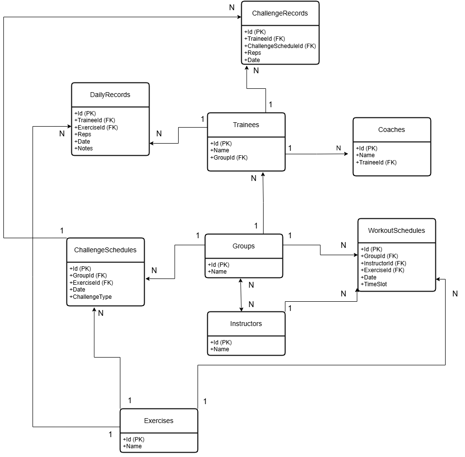
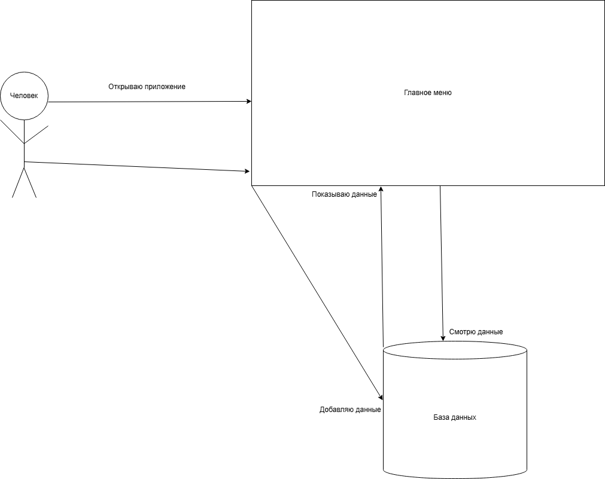

# WorkoutTracker
Приложение для учёта тренировок .

## Содержание
- Постановка задачи
- Пользователи и бизнес-процессы
- Терминологический словарь
- Требования к системе
- Интерфейс пользователя
- Детальные требования к системе
- Архитектура системы
- Диаграммы

## Постановка задачи
Создать приложение для управления тренировками: отслеживать тренирующихся, их тренеров, расписание и результаты.

## Пользователи и бизнес-процессы
- **Пользователи**: Тренеры, инструкторы, администраторы.
- **Процессы**:
  - Добавление тренирующихся и их тренеров.
  - Создание групп и расписания тренировок.
  - Запись результатов (ежедневных и челленджей).

## Терминологический словарь
- **Тренирующийся**: Человек, который занимается спортом.
- **Тренер**: Личный наставник тренирующегося.
- **Инструктор**: Ведущий групповых занятий.
- **Челлендж**: Особое задание (например, "Максимум отжиманий").

## Требования к системе
- Хранить данные о тренирующихся, тренерах, группах.
- Показывать расписание и результаты.
- Позволять добавлять и редактировать записи.

## Интерфейс пользователя
Главное окно — меню с кнопками:
- "Тренирующиеся", "Тренеры", "Инструкторы", "Группы", "Упражнения", "Расписание тренировок", "Челленджи", "Ежедневные результаты", "Результаты челленджей".
Каждая кнопка открывает окно с таблицей (DataGridView) и кнопками "Добавить" и "Сохранить".

## Детальные требования к системе
- **Функции**:
  - Добавление/удаление записей в таблицах.
  - Отображение связанных данных (например, имя группы у тренирующегося).
- **Технические требования**:
  - Использовать C# и SQLite.
  - Работать на Windows.
- **Безопасность**: Данные сохраняются локально, без доступа извне.

## Архитектура системы
- **Frontend**: Windows Forms (C#).
- **Backend**: Entity Framework Core с SQLite.
- **Структура**:
  - `Form1` — главное меню.
  - 9 форм для каждой таблицы.
  - Модели в папке `Models` (Trainee.cs, Coach.cs и т.д.).
  - Контекст базы данных: `WorkoutContext.cs`.

## Диаграммы
### ER-диаграмма базы данных
Показывает таблицы и связи.

### Диаграмма потоков данных (DFD)
Как данные движутся от пользователя к базе.

### Варианты использования
Что пользователь может делать в приложении.

### Диаграмма пакетов
Как организован код в проекте.
