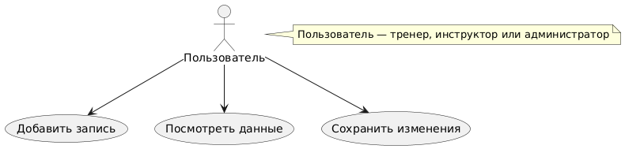
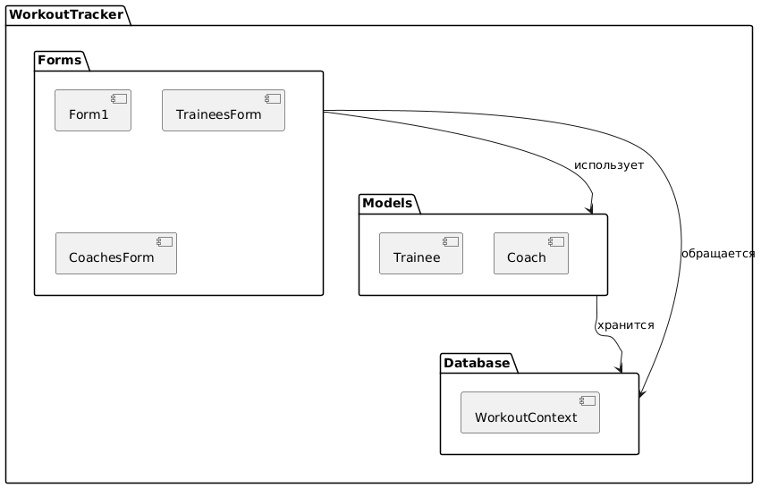
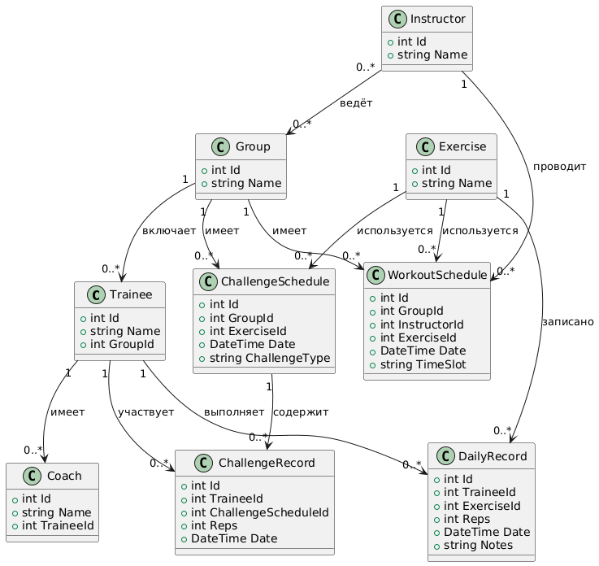
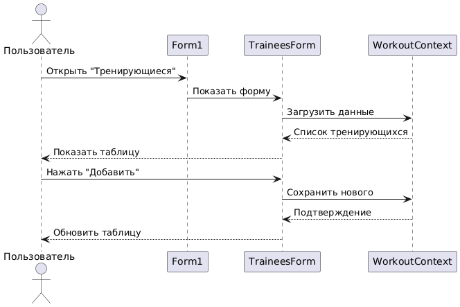

# WorkoutTracker
Приложение для учёта тренировок, разработанный в рамках учебной практики.

## Содержание
- Постановка задачи
- Пользователи и бизнес-процессы
- Терминологический словарь
- Требования к системе
- Интерфейс пользователя
- Детальные требования к системе
- Архитектура системы
- План разработки
- Руководство по установке и запуске
- Диаграммы

## Постановка задачи
Разработать приложение для управления тренировочным процессом. Цель — обеспечить учёт тренирующихся, их тренеров, инструкторов, групп, упражнений, расписания тренировок и результатов (ежедневных и челленджей).

## Пользователи и бизнес-процессы
- **Пользователи**:
  - Тренеры: следят за прогрессом тренирующихся.
  - Инструкторы: ведут групповые занятия.
  - Администраторы: управляют данными системы.
- **Бизнес-процессы**:
  - Регистрация тренирующихся, тренеров и инструкторов.
  - Формирование групп и назначение расписания тренировок.
  - Создание челленджей и запись их результатов.
  - Ведение ежедневных записей о тренировках.

## Терминологический словарь
- **Тренирующийся**: Человек, участвующий в тренировках.
- **Тренер**: Персональный наставник тренирующегося.
- **Инструктор**: Специалист, проводящий групповые занятия.
- **Группа**: Набор тренирующихся, занимающихся вместе.
- **Упражнение**: Конкретное физическое действие (например, "Отжимания").
- **Челлендж**: Специальное задание с целью (например, "Максимум повторений за минуту").

## Требования к системе
- Хранение данных о тренирующихся, тренерах, инструкторах, группах, упражнениях, расписании и результатах.
- Возможность добавления, редактирования и удаления записей.
- Отображение информации в удобном виде (таблицы).
- Локальное хранение данных без сетевого доступа.

## Интерфейс пользователя
Главное окно (`Form1`) содержит меню с пунктами:
- "Тренирующиеся", "Тренеры", "Инструкторы", "Группы", "Упражнения", "Расписание тренировок", "Челленджи", "Ежедневные результаты", "Результаты челленджей".
Каждый пункт открывает отдельную форму с таблицей (`DataGridView`) для просмотра данных и кнопками "Добавить" и "Сохранить" для управления записями.

## Детальные требования к системе
- **Функциональные требования**:
  - Добавление, удаление и редактирование записей во всех таблицах.
  - Отображение связанных данных (например, имя группы для тренирующегося).
- **Технические требования**:
  - Язык: C#.
  - База данных: SQLite с Entity Framework Core.
  - Платформа: Windows (Windows Forms).
- **Ограничения**:
  - Локальная работа без интернета.
  - Минимум ресурсов (работает на слабых ПК).

## Архитектура системы
- **Frontend**: Windows Forms — графический интерфейс с формами и таблицами.
- **Backend**: Entity Framework Core — взаимодействие с базой данных SQLite.
- **Структура проекта**:
  - `Form1.cs`: Главное меню.
  - Формы: `TraineesForm.cs`, `CoachesForm.cs` и т.д. (9 штук).
  - Модели: `Trainee.cs`, `Coach.cs` и т.д. в папке `Models`.
  - Контекст базы: `WorkoutContext.cs` для работы с SQLite.

## План разработки
1. **Анализ** (1 неделя): Сбор требований от пользователей.
2. **Проектирование** (2 недели):
   - Определение структуры базы данных.
   - Разработка интерфейса и моделей.
3. **Реализация** (3 недели):
   - Создание форм и логики.
   - Подключение базы данных.
4. **Тестирование** (1 неделя): Проверка добавления, отображения и сохранения данных.
5. **Документация** (1 неделя): Оформление всех документов и диаграмм.

## Руководство по установке и запуске
1. **Требования**:
   - ОС: Windows 10 или выше.
   - .NET Framework 4.8+.
   - Visual Studio 2022 (или другая версия с C#).
2. **Установка**:
   - Склонировать репозиторий: `git clone https://github.com/motya7331/WorkoutTracker.git`.
   - Открыть проект: найти `WorkoutTracker.sln` и открыть в Visual Studio.
3. **Запуск**:
   - Нажать F5 в Visual Studio.
   - База данных (`workouts.db`) создаётся автоматически при первом запуске.
   - Использовать меню для работы с данными.

## Диаграммы
Все диаграммы созданы с использованием PlantUML.

### Варианты использования
Показывает, что пользователь может делать в системе.

### Диаграмма пакетов
Описывает организацию кода в проекте.

### Диаграмма классов
Детализирует данные системы и их связи.

### Диаграмма последовательности
Иллюстрирует процесс добавления нового тренирующегося.
